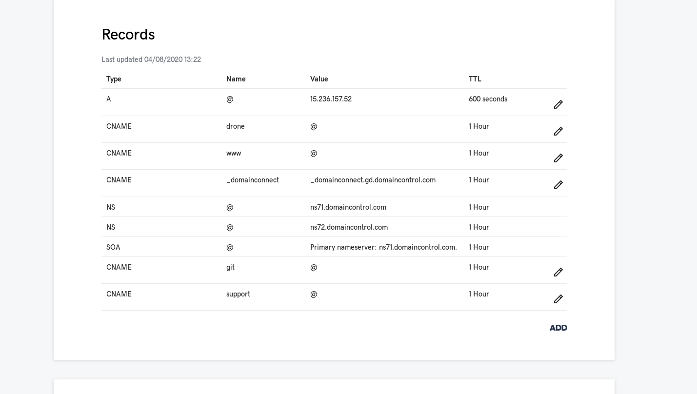

# How to run

* Configure all required subdomains (`drone.pegasusio.io`, `git.pegasusio.io`) CNAME entires, and Elastic IP for the domain name used for the demo (here `pegasusio.io`, which I bought at Goddady.com) :



* Run the `terraform` to provision the AWS EC2 instance :
  * first, you need your AWS credentials `~/.aws/credentials` (the recipe will interactivvely ask for those) :
  * now you can run the terraform :

```bash
export GIT_URI=git@github.com:gravitee-lab/drone-stack.git
export DESIRED_VERSION=HEAD
export DESIRED_VERSION="feature/simple_compose"
export D_COMPOSE_HOME=~/gitea-drone

git clone ${GIT_URI} ${D_COMPOSE_HOME}

cd ${D_COMPOSE_HOME}

git checkout ${DESIRED_VERSION}

cd terraform/

./apply.sh
# ./detroy.sh

```
  * Once the terraformation has successfully completed, the output will give you the public (Elastic) IP Address of the new EC2 instance, among other infos, like how to ssh into it.
  * ssh into the newly terraformed VM, and execute the docker/docker-compose installation using the `./terraform/post-install/docker-stack.sh` script ins this repo.
  * this script will also generate an SSH key pair to be able to git clone with SSH. You will need to add the SSH public key to your Github user settings.

* Now you're ready Run the docker compose to provision the `Drone CI` Stack :

```bash
export GIT_URI=git@github.com:gravitee-lab/drone-stack.git
export DESIRED_VERSION=HEAD
export DESIRED_VERSION="feature/simple_compose"
export D_COMPOSE_HOME=~/gitea-drone

git clone ${GIT_URI} ${D_COMPOSE_HOME}

cd ${D_COMPOSE_HOME}

git checkout ${DESIRED_VERSION}

cd compose/


# and use /etc/hosts from machines from which you access drone with http://drone.kytes.io:8000
cp ./env/osticketdb.secret-config ./env/osticketdb.secret
cp ./env/osticket.secret-config ./env/osticket.secret
cp ./env/smtp.secret-config ./env/smtp.secret

make

# And finally create the demo user in gitea
docker-compose exec gitea su git -c "gitea admin create-user --admin --name demo --password demo --email demo@pegasusio.io"

docker-compose -f docker-compose.yml logs -f reverse_proxy

echo "--"
echo "Tear down : "
echo "--"
echo 'docker-compose down --rmi all && docker system prune -f --all && docker system prune -f --volumes'
echo "--"
```

* the `/etc/hosts` (replace `192.168.1.28` with the IP Address of your VM) :

```bash
192.168.1.28 git.pegasusio.io drone.pegasusio.io support.pegasusio.io
```

* old :

```bash
git clone https://github.com/hamdouni/gitea-drone ~/gitea-drone
cd ~/gitea-drone
# là, il faut editer le docker-compose pour ouvrir le port 8000 pour le drone
# il faut aussi changer la valuer de la var. env. `DRONE_HOST` :
sed -i "s#https://drone.pegasusio.io#http://drone.kytes.io:8000#g" docker-compose.yml
# and use /etc/hosts from machines from which you access drone with http://drone.kytes.io:8000
cp env/osticketdb.secret-config env/osticketdb.secret
cp env/osticket.secret-config env/osticket.secret
cp /home/jbl/gitea-drone/env/smtp.secret-config /home/jbl/gitea-drone/env/smtp.secret
make

#
```


# IAAC Cycle

* To enter devops mode :
